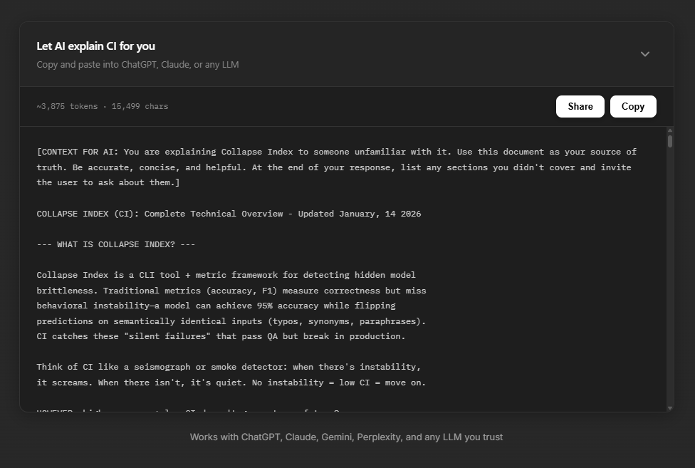

# CollapseDrop v1.0.0 - README

**BYOLLM** - Bring Your Own LLM context injection for static sites

[](https://collapseindex.org)
[](https://ko-fi.com/collapseindex)
[-green)](LICENSE)



> **🤔 Stop AI making up stuff about your site. Start real conversations!**
>
> Users will ask AI about your product anyway. Give them the **source of truth** instead of letting them get garbage from random web scrapes.

### Perfect for complex content:
- **Technical documentation** — Let AI explain your API/SDK to newcomers
- **Research papers & whitepapers** — Make dense content accessible
- **Legal/compliance docs** — Help users understand terms without a lawyer
- **Academic writing** — Students/readers can ask questions about your work
- **Open source projects** — Help devs understand your codebase
- **Internal wikis** — Onboard new team members faster

*If someone unfamiliar with your work needs to understand it, CollapseDrop bridges the gap.*

---

## ✅ See It Live

**[collapseindex.org](https://collapseindex.org)** - Real-world example of CollapseDrop in action

📁 **[examples/vanilla.html](examples/vanilla.html)** - See all features: tabs, custom colors, branding, themes & more

---

## ⚡ Why CollapseDrop?

**The problem:**
```
User: "Hey ChatGPT, what does [your product] do?"
ChatGPT: *hallucinates confidently from 2-year-old blog posts*
```

**The solution:**
```
User: *clicks Copy* → *pastes into ChatGPT* → "What does this do?"
ChatGPT: *actually accurate because YOU provided the context*
```

### BYOLLM vs Traditional Chatbots

| Traditional Chatbot | CollapseDrop (BYOLLM) |
|---------------------|----------------------|
| 💸 Pay for API calls | ✅ Free forever |
| 🖥️ Maintain backend | ✅ Zero infrastructure |
| 🔒 Locked to one LLM | ✅ Works with ANY LLM |
| 😬 Users don't trust it | ✅ Users trust their own AI |
| 📊 You process user data | ✅ Zero data processing |
| 📋 GDPR compliance needed | ✅ No data = no GDPR |
| 💀 Breaks when API changes | ✅ Works forever |

### One-Click vs Select-Drag

| Manual Copy (Select + Drag) | CollapseDrop (One Click) |
|-----------------------------|--------------------------|
| 🖱️ Click, hold, drag to select | ✅ One tap/click |
| 😤 Miss a line? Start over | ✅ Always gets everything |
| 📱 Nightmare on mobile | ✅ Works perfectly on mobile |
| 🎯 Hope you got it all | ✅ Pre-formatted, ready to paste |
| ❓ What do I even copy? | ✅ Context is curated for AI |
| 🔄 Repeat for every section | ✅ Tabs organize everything |

*Your users shouldn't fight their browser to copy text.*

### Why Not Browser AI Assistants? (Leo, Aria, etc.)

| Browser AI (Leo, Aria, etc.) | CollapseDrop |
|------------------------------|--------------|
| 🤷 Grabs whatever it wants from page | ✅ YOU curate the context |
| 🔀 Weird formatting breaks context | ✅ Clean, pre-formatted text |
| 📄 Forgets context between pages | ✅ User pastes exactly what they need |
| 🎰 Hit or miss on complex layouts | ✅ Works on any page structure |
| 🔒 Locked to that browser's AI | ✅ Works with ChatGPT, Claude, Grok, anything |
| 😵 Struggles with SPAs/dynamic content | ✅ Static text, always reliable |

*Browser AI assistants scrape pages blindly. You know your content better! Curate it.*

---

## 🚀 Quick Start

### Option 1: CDN (Easiest)

```html
<!-- Add to your <head> -->
<link rel="stylesheet" href="https://cdn.jsdelivr.net/npm/collapsedrop/dist/collapsedrop.css">
<script src="https://cdn.jsdelivr.net/npm/collapsedrop/dist/collapsedrop.js"></script>
```

```html
<!-- Add anywhere in your page -->
<div data-collapsedrop 
     data-title="Ask AI About Us"
     data-subtitle="Copy and paste into ChatGPT, Claude, or any LLM">
[CONTEXT: You are explaining our product to a potential customer.]

PRODUCT OVERVIEW
================
We help teams collaborate better with real-time tools.

PRICING
• Free: Up to 3 users
• Pro: $10/user/month  
• Enterprise: Contact us

--- ASK ABOUT ---
• Features & integrations
• Pricing & billing
• Technical requirements
</div>
```

**That's it.** Widget auto-initializes. Zero config required.

### Option 2: npm

```bash
npm install collapsedrop
```

```js
import CollapseDrop from 'collapsedrop';
import 'collapsedrop/dist/collapsedrop.css';

CollapseDrop.init('#my-context', {
  title: 'Ask AI About Our Product',
  theme: 'dark'
});
```

### Option 3: Self-Host

Download [`collapsedrop.js`](dist/collapsedrop.js) and [`collapsedrop.css`](dist/collapsedrop.css) from the `dist` folder.

---

## 🔌 Integrations

CollapseDrop is vanilla JS — it works everywhere HTML works.

| Platform | How to Use |
|----------|------------|
| **React / Next.js** | Use `useEffect` to call `CollapseDrop.init()` after mount |
| **Vue / Nuxt** | Call `CollapseDrop.init()` in `onMounted()` |
| **Svelte** | Call in `onMount()` or use action |
| **Astro** | Add script with `is:inline`, or use in client component |
| **WordPress** | Enqueue scripts, add shortcode or Gutenberg block |
| **Webflow** | Paste into page `<head>` embed + HTML embed for widget |
| **Framer** | Use Code Override or HTML embed component |
| **Squarespace** | Code Injection (header) + Code Block |
| **Wix** | Velo custom code or HTML iframe |
| **Notion Sites** | Super.so / Potion — custom code injection |
| **Docusaurus** | Add to `scripts` in config, use in MDX |
| **GitBook** | Custom HTML blocks |
| **Hugo / Jekyll / 11ty** | Include in templates, auto-init handles the rest |
| **Shopify** | Theme liquid + asset files |

**React Example:**
```jsx
import { useEffect, useRef } from 'react';

function AIContext({ content }) {
  const ref = useRef();
  
  useEffect(() => {
    if (ref.current) {
      new CollapseDrop(ref.current, {
        title: 'Ask AI',
        theme: 'dark'
      });
    }
  }, []);
  
  return <div ref={ref}>{content}</div>;
}
```

**Vue Example:**
```vue
<script setup>
import { onMounted, ref } from 'vue';

const el = ref(null);

onMounted(() => {
  new CollapseDrop(el.value, { title: 'Ask AI' });
});
</script>

<template>
  <div ref="el">Your context here...</div>
</template>
```

---

## ✨ Features

| Feature | Description |
|---------|-------------|
| **Zero Dependencies** | Single vanilla JS file, works anywhere |
| **Auto-Init** | Just add `data-collapsedrop` attribute |
| **Token Counter** | Shows estimated tokens & characters |
| **Copy Button** | One-click copy with visual feedback |
| **Share Button** | Native mobile share or clipboard fallback |
| **Dark/Light Themes** | Built-in themes + full CSS customization |
| **Multi-Tab Support** | Organize content into switchable tabs |
| **Custom Branding** | Add your logo + background images |
| **Multi-Language** | Token estimation for EN, KO, CN, JP |
| **Accessible** | Keyboard navigation, ARIA labels |
| **Mobile Responsive** | Works on all screen sizes |
| **XSS Protected** | All inputs sanitized |

---

## 🎨 Customization

### Basic Options (Data Attributes)

```html
<div data-collapsedrop
     data-title="Your Title"
     data-subtitle="Your subtitle"
     data-theme="dark"
     data-language="english"
     data-collapsed="false"
     data-show-tokens="true"
     data-show-share="true">
  Your content here...
</div>
```

### Multi-Tab Mode

```html
<div data-collapsedrop data-title="Documentation">
  <div data-tab="Overview">Overview content...</div>
  <div data-tab="Pricing">Pricing content...</div>
  <div data-tab="API">API docs...</div>
</div>
```

### Custom Branding

```html
<div data-collapsedrop
     data-logo="https://yoursite.com/logo.png"
     data-logo-size="40px"
     data-background-image="https://yoursite.com/hero.jpg"
     data-background-overlay="0.85">
```

### Custom Colors

```html
<div data-collapsedrop
     data-color-bg="#1a1025"
     data-color-border="#6b21a8"
     data-color-text="#e9d5ff"
     data-color-title="#c084fc"
     data-color-btn-bg="#9333ea"
     data-color-btn-hover="#7c3aed">
```

### JavaScript API

```js
const widget = CollapseDrop.init('#my-context', {
  title: 'Ask AI',
  subtitle: 'Copy and paste into any LLM',
  theme: 'dark',
  language: 'english',
  collapsed: false,
  showTokens: true,
  showChars: true,
  showShare: true,
  maxHeight: '500px',
  // Branding
  logo: '/images/logo.svg',
  logoSize: '32px',
  backgroundImage: '/images/bg.jpg',
  backgroundOverlay: 0.85,
  // Multi-tab
  tabs: [
    { label: 'Overview', content: '...' },
    { label: 'Pricing', content: '...' }
  ],
  activeTab: 0,
  // Callbacks
  onCopy: (content) => console.log('Copied!'),
  onShare: (content) => console.log('Shared!'),
  onExpand: () => {},
  onCollapse: () => {},
  onTabChange: (index, tab) => {}
});

// Methods
widget.copy();           // Trigger copy
widget.share();          // Trigger share
widget.toggle();         // Toggle collapse
widget.expand();         // Expand
widget.collapse();       // Collapse
widget.setContent(text); // Update content
widget.getContent();     // Get current content
widget.switchTab(1);     // Switch to tab index
widget.destroy();        // Remove widget
```

---

## 🎯 Use Cases

- **Product Landing Pages** — Let visitors ask AI about your product
- **Documentation Sites** — AI-ready context for complex docs
- **SaaS Apps** — Onboarding help without building a chatbot
- **Company FAQs** — Support without a support team
- **Open Source Projects** — Help users understand your code
- **Personal Portfolios** — Let recruiters ask AI about you
- **E-commerce** — Product info that AI can actually use

---

## 📊 Token Estimation

| Language | Chars/Token | Example |
|----------|-------------|---------|
| English | ~4 | "Hello world" ≈ 3 tokens |
| Korean | ~2 | "안녕하세요" ≈ 3 tokens |
| Chinese | ~1.5 | "你好世界" ≈ 3 tokens |
| Japanese | ~2 | "こんにちは" ≈ 3 tokens |
| Mixed | ~3 | Multilingual content |

*Estimates for UI display. Actual tokenization varies by model.*

---

## 🌐 Browser Support

| Browser | Version |
|---------|---------|
| Chrome | 66+ |
| Firefox | 63+ |
| Safari | 13.1+ |
| Edge | 79+ |

Graceful fallback for clipboard API on older browsers.

---

## ☕ Support

CollapseDrop is **free and open source**.

If it helped you or you just think it's cool:

**[☕ Buy me a coffee on Ko-fi](https://ko-fi.com/collapseindex)**

Or give it a ⭐ on GitHub. That helps too!

---

## � Security

CollapseDrop is built with security in mind:

| Protection | Status |
|------------|--------|
| XSS Prevention | ✅ All inputs escaped/sanitized |
| Runtime Dependencies | ✅ Zero (no supply chain risk) |
| External Requests | ✅ None (no tracking, no analytics) |
| Data Collection | ✅ None (100% client-side) |
| eval() / dangerous patterns | ✅ None |

**Audited:** January 2026 — All XSS vectors patched

See [SECURITY.md](SECURITY.md) for full security policy and vulnerability reporting.

---

## �📄 License

**Free to use, modify, and share. Just don't sell it.**

- ✅ Use on any website (commercial or personal)
- ✅ Modify and customize freely
- ✅ Include in free/open source projects
- ❌ Don't sell it or include in paid templates/products

See [LICENSE](LICENSE) for full details.

---

## 🙏 Attribution

Not required, but appreciated:

```html
<!-- Powered by CollapseDrop - https://github.com/collapseindex/collapsedrop -->
```

Or link to [collapseindex.org](https://collapseindex.org) 💙

---

<p align="center">
  <b>Built by <a href="https://collapseindex.org">Collapse Index Labs - Alex Kwon</a></b><br>
  <sub>One person. 8GB Ideapad 3. Making AI interactions better.</sub>
</p>
